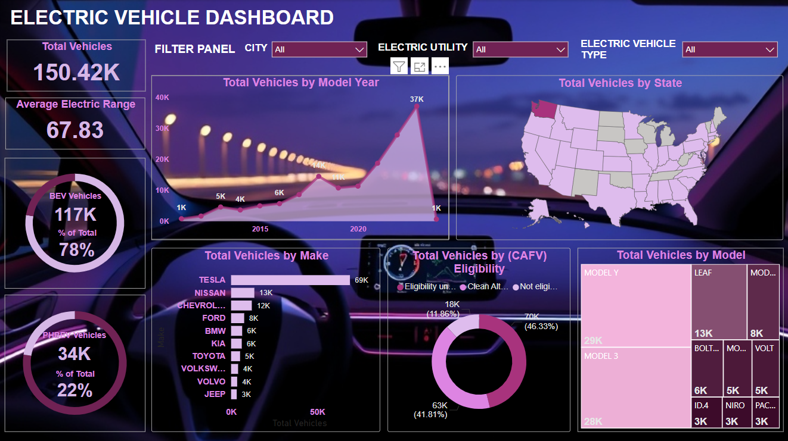

# Electric Vehicle Dashboard Project

This Power BI project offers a comprehensive overview of the electric vehicle (EV) landscape across various metrics, including vehicle types, range, manufacturer data, model popularity, and geographic distribution. Designed to provide actionable insights for stakeholders in the EV industry, this dashboard enables data-driven decision-making for market expansion, resource allocation, and strategy refinement.

## Project Overview

### Objective
The goal of this analysis is to understand trends in electric vehicle adoption, with a focus on vehicle type, range, geographic distribution, and popular models. By identifying patterns across these areas, this dashboard helps inform strategic decisions on infrastructure, marketing, and product development in the EV sector.

### Tools and Technologies
- **Power BI**: Used for data visualization, dashboard design, and interactive filtering
- **Data Sources**: EV registration data, charging infrastructure, and market data

## Dashboard Summary

### Key Metrics and Visuals
The dashboard provides insights into several key metrics:
- **Total Vehicles**: Displays the total count of EVs analyzed, broken down into BEV (Battery Electric Vehicles) and PHEV (Plug-In Hybrid Electric Vehicles) categories.
- **Average Electric Range**: Shows the average electric range across all EVs in the dataset, offering a snapshot of vehicle efficiency.
- **Vehicle Distribution by Model Year**: A line chart tracking the number of EVs by model year, indicating growth trends and model year preferences.
- **Total Vehicles by Make**: A bar chart visualizing EV distribution by manufacturer, highlighting Tesla as the leading make.
- **CAFV (Clean Alternative Fuel Vehicle) Eligibility**: A donut chart indicating the percentage of EVs eligible for clean fuel benefits, segmented by eligibility status.
- **Total Vehicles by Model**: A treemap showcasing the most popular EV models, with Model Y and Model 3 leading in adoption.
- **Total Vehicles by State**: A map highlighting EV distribution across U.S. states, providing insights into regional adoption patterns.

### Filter Panel
The dashboard includes filters for:
- **City**: Allows viewers to filter data by specific cities
- **Electric Utility**: Filters by electric utility providers to analyze EV data across different power suppliers
- **Electric Vehicle Type**: Filters between BEV and PHEV to allow users to view data relevant to a specific vehicle type

## Key Findings

1. **Dominance of Battery Electric Vehicles (BEV)**
   - The dashboard reveals that BEVs make up a significant portion (78%) of the total EVs, indicating strong market preference for fully electric vehicles over hybrid options.

2. **Growth in EV Adoption Over Recent Years**
   - The trend in vehicle model years shows a rapid increase in EV adoption, especially from 2017 onwards. This aligns with growing public interest, technological advancements, and supportive policy measures for EVs.

3. **Tesla's Market Leadership**
   - Tesla emerges as the leading manufacturer, with the highest number of vehicles in the dataset. Model Y and Model 3 are particularly popular, as shown in the treemap, solidifying Tesla's strong presence in the EV market.

4. **Geographic Disparities in EV Adoption**
   - The map visualization highlights that certain states have significantly higher EV adoption rates, pointing to regional variations in infrastructure, incentives, and consumer interest. This insight is valuable for targeted infrastructure investments and market expansion strategies.

5. **Variability in CAFV Eligibility**
   - Not all EVs qualify for Clean Alternative Fuel Vehicle benefits, with approximately 46% marked as "not eligible." This insight is essential for understanding regulatory impacts on consumer incentives and adoption trends.
   

## Conclusion
This Power BI dashboard offers a powerful tool for understanding the electric vehicle market across critical metrics. By leveraging these insights, stakeholders can make informed decisions on infrastructure development, marketing strategies, and regulatory alignment to support continued EV growth. The dashboard's interactive features enable a flexible, user-focused experience, empowering users to explore data based on specific interests and needs.
